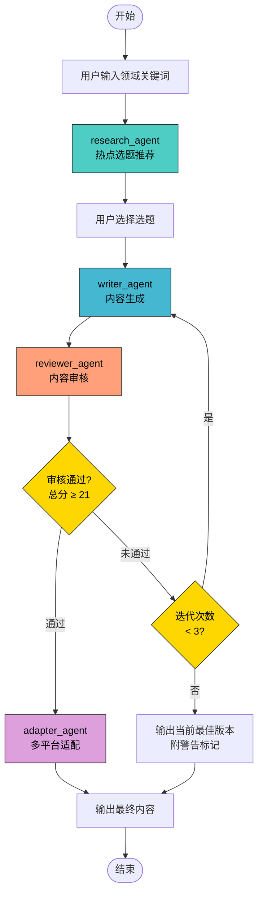
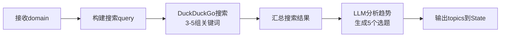
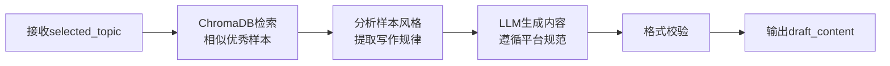
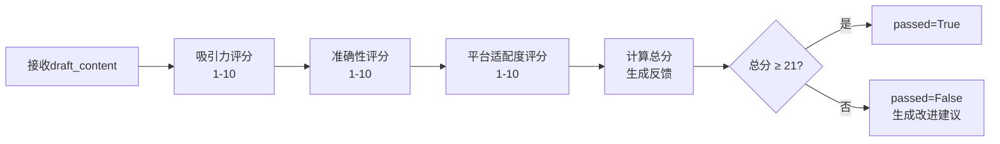
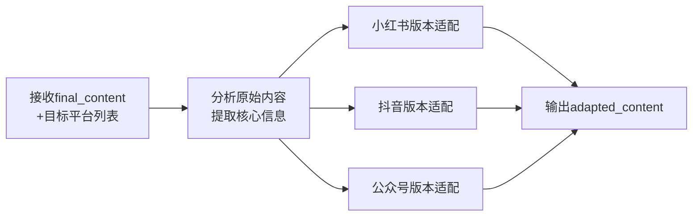
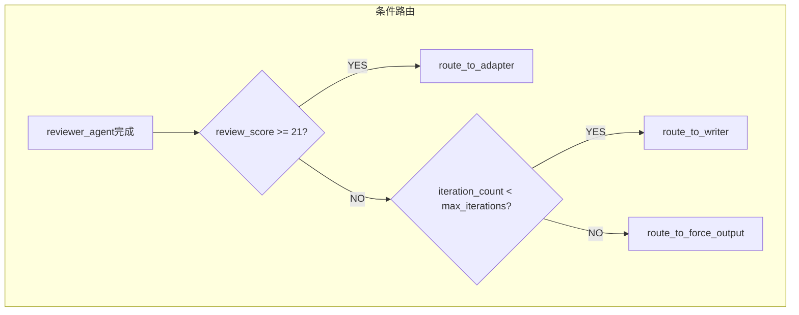
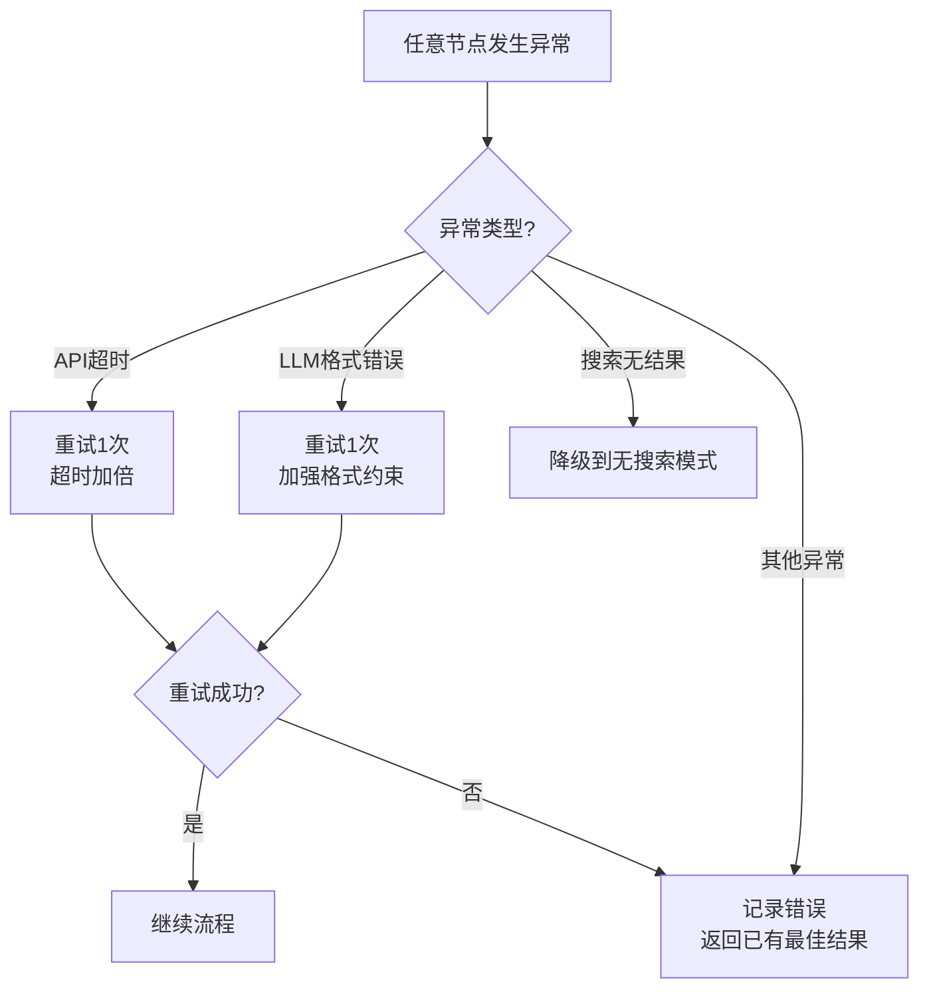

# 自媒体运营Agent - 工作流设计文档

> 文档版本：v1.0 | 更新日期：2026-04-01 | 作者：产品团队  
> 本文档是自媒体智能运营Agent系统的核心技术设计文档，定义LangGraph状态机、各Agent节点详细设计及工作流编排逻辑。

---

## 1. 整体架构设计

### 1.1 LangGraph 状态机总览



### 1.2 工作流编排说明

整个系统采用 **LangGraph StateGraph** 实现，核心设计原则：

1. **单向主流程**：research → writer → reviewer → adapter，保证流程清晰
2. **条件回路**：reviewer → writer 的审核迭代回路，实现质量闭环
3. **上限保护**：最多迭代3轮，防止无限循环
4. **人机协作点**：选题推荐后由用户确认选择，保留人工决策权

---

## 2. 全局状态定义

### 2.1 State Schema

```python
from typing import TypedDict, List, Optional

class MediaAgentState(TypedDict):
    # 用户输入
    domain: str                        # 用户指定的领域/关键词
    target_platform: str               # 目标平台（小红书/抖音/公众号）

    # Research Agent 输出
    topics: List[dict]                 # 推荐选题列表（5个）
    selected_topic: Optional[dict]     # 用户选定的选题

    # Writer Agent 输出
    draft_content: Optional[dict]      # 草稿内容 {title, body, tags}

    # Reviewer Agent 输出
    review_result: Optional[dict]      # 审核结果 {scores, feedback, passed}
    review_score: float                # 审核总分

    # Adapter Agent 输出
    adapted_content: Optional[dict]    # 各平台适配内容

    # 流程控制
    iteration_count: int               # 当前迭代次数
    max_iterations: int                # 最大迭代次数（默认3）
    current_node: str                  # 当前执行节点
    error: Optional[str]               # 错误信息
    final_content: Optional[dict]      # 最终输出内容
```

### 2.2 状态字段详细说明

| 字段 | 类型 | 来源 | 用途 |
|------|------|------|------|
| `domain` | str | 用户输入 | 选题搜索的领域范围 |
| `target_platform` | str | 用户输入 | 内容生成的目标平台 |
| `topics` | List[dict] | Research Agent | 存储5个推荐选题 |
| `selected_topic` | dict | 用户选择 | 用户确认的选题 |
| `draft_content` | dict | Writer Agent | 当前版本的草稿内容 |
| `review_result` | dict | Reviewer Agent | 完整审核结果（含分维度评分） |
| `review_score` | float | Reviewer Agent | 审核总分（3个维度之和，满分30） |
| `final_content` | dict | 流程终点 | 最终确认的内容 |
| `adapted_content` | dict | Adapter Agent | 多平台适配后的内容集合 |
| `iteration_count` | int | 流程控制 | 跟踪writer-reviewer迭代次数 |
| `max_iterations` | int | 配置项 | 最大允许迭代次数（默认3） |
| `current_node` | str | 系统 | 当前执行到的节点名称 |
| `error` | str | 异常捕获 | 任何节点的错误信息 |

### 2.3 关键数据结构

**Topic（选题）**：
```python
{
    "title": "2026春季必入的5款平价防晒测评",
    "reason": "防晒话题进入季节高峰，平价关键词搜索量上升45%",
    "heat_score": 9,
    "platforms": ["小红书", "抖音"],
    "angle": "以实测数据对比为核心，突出性价比"
}
```

**DraftContent（草稿内容）**：
```python
{
    "title": "💄 5款百元防晒实测！第3款真的绝了",
    "body": "姐妹们！夏天快到了...",
    "tags": ["防晒测评", "平价好物", "夏日必备", "护肤分享", "好物推荐"]
}
```

**ReviewResult（审核结果）**：
```python
{
    "scores": {
        "attractiveness": 8,    # 吸引力 (1-10)
        "accuracy": 7,          # 准确性 (1-10)
        "platform_fit": 9       # 平台适配度 (1-10)
    },
    "total_score": 24,          # 总分 (满分30)
    "passed": True,             # 是否通过 (总分≥21)
    "feedback": [               # 改进建议列表
        "建议在第二段增加具体的SPF数值对比数据",
        "hashtag可以增加'防晒推荐'这个高热度标签"
    ],
    "summary": "内容整体质量良好，标题吸引力强..."
}
```

---

## 3. 各节点详细设计

### 3.1 Research Agent 节点



#### 节点配置

| 配置项 | 值 |
|--------|-----|
| 节点名称 | `research_agent` |
| 输入字段 | `state.domain`, `state.target_platform` |
| 输出字段 | `state.topics` |
| 使用工具 | DuckDuckGo Search |
| LLM | DeepSeek Chat |
| 超时时间 | 30秒 |

#### 工具调用策略

1. **搜索关键词构建**：基于用户领域，生成3-5组搜索query
   - `"{domain} 最新热点 2026"`
   - `"{domain} 小红书 爆款话题"`
   - `"{domain} 趋势 热搜"`
2. **搜索执行**：每组query取top 5结果，共获取15-25条信息
3. **去重与过滤**：去除重复信息，过滤低质量/广告内容

#### Prompt策略

- **角色设定**：资深自媒体选题策划专家
- **输出约束**：严格JSON格式，必须包含5个选题
- **评估标准**：热度、时效性、话题性、可创作性
- 详细Prompt见《Prompt设计文档》

#### 异常处理

| 异常场景 | 处理策略 |
|----------|----------|
| 搜索API无结果 | 使用备用搜索词重试一次，仍无结果则基于LLM知识生成选题 |
| 搜索API超时 | 重试一次（超时5秒），仍失败则fallback到无搜索模式 |
| LLM输出格式错误 | 重新请求，附加更严格的格式约束 |

---

### 3.2 Writer Agent 节点



#### 节点配置

| 配置项 | 值 |
|--------|-----|
| 节点名称 | `writer_agent` |
| 输入字段 | `state.selected_topic`, `state.target_platform`, `state.review_result`（迭代时） |
| 输出字段 | `state.draft_content`, `state.iteration_count`（+1） |
| 使用工具 | ChromaDB Retriever |
| LLM | DeepSeek Chat |
| 超时时间 | 30秒 |

#### 知识库检索策略

1. **检索Query构建**：`selected_topic.title` + `target_platform` 拼接
2. **检索数量**：top 3 相似样本
3. **相似度阈值**：cosine similarity > 0.7，低于阈值则不使用样本
4. **样本使用方式**：作为风格参考注入Prompt，而非直接复制

#### 内容生成规则

**小红书内容规范**：
| 要素 | 规则 |
|------|------|
| 标题 | 20字内，必须含1-2个emoji，使用"标题党"技巧（数字、反问、悬念） |
| 正文开头 | 前2句必须抓住眼球（反转、提问、感叹） |
| 正文结构 | 短段落（2-3句/段），每段配emoji分隔 |
| 正文长度 | 500-800字 |
| emoji密度 | 每2-3句至少1个emoji |
| 标签 | 5-8个，前2个为高热度通用标签，后3-6个为精准长尾标签 |

#### 迭代写作逻辑

当从Reviewer Agent回流时（`iteration_count > 0`）：
1. 读取 `state.review_result.feedback` 获取改进建议
2. 在Prompt中注入上一版内容和具体改进要求
3. 要求LLM针对性修改，而非完全重写

---

### 3.3 Reviewer Agent 节点



#### 节点配置

| 配置项 | 值 |
|--------|-----|
| 节点名称 | `reviewer_agent` |
| 输入字段 | `state.draft_content`, `state.target_platform`, `state.selected_topic` |
| 输出字段 | `state.review_result`, `state.review_score` |
| 使用工具 | 无（纯LLM评估） |
| LLM | DeepSeek Chat |
| 超时时间 | 15秒 |

#### 评分维度详细定义

**维度一：吸引力（Attractiveness）**

| 分数 | 标准 |
|------|------|
| 9-10 | 标题极具吸引力，开头有强烈hook，读者无法不点击 |
| 7-8 | 标题有吸引力，开头能引起兴趣，整体阅读体验流畅 |
| 5-6 | 标题一般，开头平淡，但内容尚可 |
| 3-4 | 标题无吸引力，开头无法留住读者 |
| 1-2 | 完全没有吸引力，标题平庸，内容无趣 |

**维度二：准确性（Accuracy）**

| 分数 | 标准 |
|------|------|
| 9-10 | 信息完全准确，逻辑严谨，有数据支撑 |
| 7-8 | 信息基本准确，逻辑通顺，偶有模糊表述 |
| 5-6 | 部分信息待验证，逻辑基本通顺 |
| 3-4 | 存在明显事实错误或逻辑漏洞 |
| 1-2 | 大量错误信息，逻辑混乱 |

**维度三：平台适配度（Platform Fit）**

| 分数 | 标准 |
|------|------|
| 9-10 | 完全符合目标平台的格式、风格、字数要求，像资深运营手写 |
| 7-8 | 基本符合平台规范，风格接近，细节可优化 |
| 5-6 | 部分符合平台规范，但有明显的格式/风格偏差 |
| 3-4 | 不太符合平台风格，更像通用文章 |
| 1-2 | 完全不符合目标平台的要求 |

#### 审核决策逻辑

```python
total_score = scores["attractiveness"] + scores["accuracy"] + scores["platform_fit"]
passed = total_score >= 21  # 总分满分30，阈值21（70%）
```

#### 反馈输出格式

未通过审核时，必须输出：
1. 各维度扣分原因（具体指出哪里不好）
2. 针对性改进建议（具体说明如何改进）
3. 优先级排序（哪个问题最需要优先修复）

---

### 3.4 Adapter Agent 节点



#### 节点配置

| 配置项 | 值 |
|--------|-----|
| 节点名称 | `adapter_agent` |
| 输入字段 | `state.final_content`, 目标平台列表 |
| 输出字段 | `state.adapted_content` |
| 使用工具 | 无（纯LLM转换） |
| LLM | DeepSeek Chat |
| 超时时间 | 30秒 |

#### 平台适配规则库

| 规则维度 | 小红书 | 抖音 | 公众号 |
|----------|--------|------|--------|
| 内容形式 | 图文笔记 | 短视频脚本 | 长文章 |
| 标题长度 | ≤ 20字 | ≤ 15字 | ≤ 25字 |
| 正文长度 | 500-800字 | 150-300字（口播脚本） | 1500-2500字 |
| 语言风格 | 亲切、种草感、emoji丰富 | 口语化、节奏感强、有梗 | 深度、专业、有观点 |
| emoji使用 | 高频（每2-3句） | 中频（标题+关键句） | 低频（仅小标题） |
| 段落结构 | 短段落、列表、emoji分隔 | 分镜脚本（画面+台词） | 长段落、小标题分节 |
| 标签格式 | #标签 （5-8个） | #话题 （3-5个） | 文末标签（2-3个） |
| CTA（行动号召） | "收藏备用"、"关注不迷路" | "点赞+关注"、"评论区见" | "在看"、"转发" |

#### 适配策略

**小红书 → 抖音**：
1. 将图文要点提炼为口播脚本
2. 添加画面描述提示（[画面：展示产品特写]）
3. 调整为口语化表达
4. 增加节奏感（"首先...其次...最后..."）
5. 缩减总字数至150-300字

**小红书 → 公众号**：
1. 保留核心观点，大幅扩充论证
2. 增加数据、案例、引用
3. 减少emoji，增加小标题
4. 调整为分析性/观点性文风
5. 增加开头引言和结尾总结

---

## 4. 条件边与路由设计

### 4.1 条件边定义



#### 路由函数设计

```python
def review_router(state: MediaAgentState) -> str:
    """审核后的条件路由"""
    if state["review_result"]["passed"]:
        return "adapter_agent"
    elif state["iteration_count"] < state["max_iterations"]:
        return "writer_agent"
    else:
        return "force_output"
```

### 4.2 全部边定义

| 起始节点 | 目标节点 | 类型 | 条件 |
|----------|----------|------|------|
| START | research_agent | 普通边 | - |
| research_agent | user_select | 普通边 | - |
| user_select | writer_agent | 普通边 | - |
| writer_agent | reviewer_agent | 普通边 | - |
| reviewer_agent | adapter_agent | 条件边 | 审核通过 |
| reviewer_agent | writer_agent | 条件边 | 未通过且迭代次数未满 |
| reviewer_agent | force_output | 条件边 | 未通过且迭代次数已满 |
| adapter_agent | END | 普通边 | - |
| force_output | END | 普通边 | - |

---

## 5. LangGraph 实现伪代码

```python
from langgraph.graph import StateGraph, END

workflow = StateGraph(MediaAgentState)

# 添加节点
workflow.add_node("research_agent", research_node)
workflow.add_node("writer_agent", writer_node)
workflow.add_node("reviewer_agent", reviewer_node)
workflow.add_node("adapter_agent", adapter_node)
workflow.add_node("force_output", force_output_node)

# 设置入口
workflow.set_entry_point("research_agent")

# 添加普通边
workflow.add_edge("research_agent", "writer_agent")
workflow.add_edge("writer_agent", "reviewer_agent")
workflow.add_edge("adapter_agent", END)
workflow.add_edge("force_output", END)

# 添加条件边
workflow.add_conditional_edges(
    "reviewer_agent",
    review_router,
    {
        "adapter_agent": "adapter_agent",
        "writer_agent": "writer_agent",
        "force_output": "force_output",
    }
)

# 编译
app = workflow.compile()
```

---

## 6. 错误处理与降级策略

### 6.1 全局错误处理



### 6.2 各节点降级策略

| 节点 | 异常场景 | 降级策略 |
|------|----------|----------|
| research_agent | 搜索API不可用 | 基于LLM知识生成选题（注明"未获取实时热点"） |
| research_agent | LLM响应格式错误 | 自动修复JSON + 重试，最多2次 |
| writer_agent | ChromaDB不可用 | 不使用样本参考，纯LLM生成 |
| writer_agent | 生成内容为空 | 切换Prompt模板重试 |
| reviewer_agent | 评分格式错误 | 使用正则提取分数 + 默认反馈 |
| adapter_agent | 适配失败 | 返回原始内容 + 基础格式调整 |

### 6.3 超时与重试策略

| 参数 | 值 | 说明 |
|------|-----|------|
| 单节点超时 | 30秒 | 单个Agent节点最大执行时间 |
| 全流程超时 | 3分钟 | 整个工作流最大执行时间 |
| 单次重试延迟 | 2秒 | 重试前的等待时间 |
| 最大重试次数 | 1次 | 每个节点最多重试1次 |

---

## 7. 监控与日志设计

### 7.1 关键监控指标

| 指标 | 来源 | 告警阈值 |
|------|------|----------|
| 节点执行耗时 | 每个节点的计时 | > 30秒告警 |
| 审核通过率 | reviewer_agent统计 | < 30%告警 |
| 迭代次数分布 | iteration_count统计 | 平均 > 2.5轮告警 |
| 全流程成功率 | 最终输出统计 | < 90%告警 |

### 7.2 日志记录

每个节点执行时记录：
```json
{
    "timestamp": "2026-04-01T10:30:00Z",
    "node": "writer_agent",
    "iteration": 1,
    "input_summary": "topic: 防晒测评, platform: 小红书",
    "output_summary": "generated 650 chars, 6 tags",
    "duration_ms": 12500,
    "tokens_used": 2800,
    "status": "success"
}
```

---

## 8. 扩展性设计

### 8.1 新增Agent节点

系统设计支持通过以下步骤添加新的Agent节点：

1. 定义节点函数，遵循 `(state: MediaAgentState) -> dict` 接口
2. 在State中添加对应字段
3. 在StateGraph中注册节点和边
4. 编写对应的Prompt

### 8.2 预留扩展点

| 扩展方向 | 预留接口 | 计划阶段 |
|----------|----------|----------|
| SEO优化Agent | adapter_agent后插入 | V2 |
| 图片生成Agent | writer_agent后并行 | V2 |
| 数据分析Agent | 独立入口 | V3 |
| 发布Agent | 流程末尾 | V3 |

---

*文档结束*
