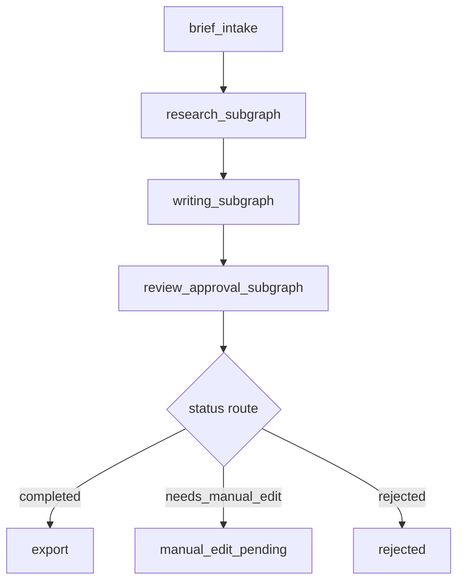

# 项目2 LangGraph 迁移设计（v1）

最后更新：2026-04-09

## 1. 迁移目标

把项目2从当前的手写状态机迁移为：

- `LangGraph StateGraph`
- 真 `SubGraph`
- 真 `PostgreSQL Checkpointer`
- 支持后续 `astream_events / SSE`

本轮重点是**设计与骨架准备**，不直接推翻现有主链路。

## 2. 迁移原则

1. 保留业务闭环，不保留旧调度实现。
2. 先把 state schema 和 graph layout 定清楚，再写节点。
3. 旧版 `src/agent_graph.py` 继续保留为 baseline，不直接就地大改。
4. 新版骨架放到独立目录，避免影响当前可运行版本。

## 3. 目录建议

建议新增目录：

```text
src/langgraph_v2/
  __init__.py
  settings.py
  state.py
  layout.py
  parsers.py
  subgraphs/
    __init__.py
```

后续若进入实现阶段，再逐步补：

```text
  nodes/
  checkpoint/
  api/
  metrics/
```

## 4. 目标状态 schema

## 4.1 设计原则

- `state` 既要能服务 LangGraph 路由，也要能服务持久化与事件流
- 需要兼容：
  - 用户输入
  - 节点产物
  - 审批分支
  - metrics
  - streaming events
  - 错误记录
  - mock flags

## 4.2 核心字段

### 身份与执行上下文

- `run_id`
- `request_id`
- `thread_id`
- `graph_version`
- `status`

### 用户输入

- `brief`
- `platform`
- `style`
- `approval_decision`
- `approval_note`

### 业务产物

- `selected_topic`
- `research`
- `draft`
- `review`
- `approval`
- `content_package`

### 控制字段

- `reviewer_threshold`
- `max_revisions`
- `revision_count`
- `trace`

### 观测字段

- `metrics`
- `events`
- `errors`

### 环境与开关

- `mock_flags`
- `runtime_flags`

## 5. Graph / SubGraph 结构设计

## 5.1 主图



## 5.2 Research SubGraph

职责：

- 将 brief 转成候选 topic
- 汇总外部/内部 evidence
- 产出结构化 research 结果

节点建议：

- `research_topic`
- `research_evidence_merge`

保留原因：

- 这是后续增强搜索、Graph RAG、并发检索的主要入口

## 5.3 Writing SubGraph

职责：

- 根据 selected topic 写出第一版草稿
- 完成平台适配

节点建议：

- `write_draft`
- `adapt_platform`

保留原因：

- 旧版 adapter 已存在，迁移时不应丢失平台化语义

## 5.4 Review / Approval SubGraph

职责：

- 输出结构化 review
- 决定 rewrite / approve / needs_edit / reject

节点建议：

- `review_structured`
- `review_route`
- `approval_gate`

保留原因：

- 这是最能体现“AI + 人工协作闭环”的部分

## 6. 路由设计

### 6.1 Review 路由

规则：

- `review.total_score >= reviewer_threshold`：进入 `approval_gate`
- 不达标且 `revision_count < max_revisions`：回到 `write_draft`
- 不达标且达到上限：进入 `approval_gate`，由人工决定 `needs_edit` 或 `reject`

### 6.2 Approval 路由

规则：

- `approve` -> `export`
- `needs_edit` -> `manual_edit_pending`
- `reject` -> `rejected`

## 7. PostgreSQL Checkpointer 接入方案

## 7.1 目标

让新版 graph 具备：

- 按 `thread_id` / `run_id` 恢复执行
- 历史状态回查
- 节点级执行记录的恢复基础

## 7.2 接入策略

### 阶段A：设计与环境确认

- 确认使用本地 Postgres 还是 Docker Postgres
- 明确连接方式用环境变量管理
- 保留 `CHECKPOINTER_MOCK` 作为无 Postgres 场景下的开发兜底

### 阶段B：代码接入

- 在独立 `langgraph_v2` 目录中接入 checkpointer
- 不覆盖旧版 SQLite 存储
- 新旧两套可并存

### 阶段C：验证

- 验证 run 保存
- 验证 run 恢复
- 验证历史回查

## 7.3 环境变量建议

后续建议增加：

- `CHECKPOINT_BACKEND=postgres`
- `POSTGRES_DSN=...`
- `CHECKPOINTER_MOCK=false`

说明：

- 当前只先设计，不在这一轮强绑定具体依赖包名
- 真正接入前需按 LangGraph 当时的官方推荐方式再确认依赖

## 8. 流式输出设计

## 8.1 目标

后续通过 `astream_events` 或等价事件流，支持：

- 节点开始 / 结束事件
- 状态更新事件
- 首字延迟测量
- 前端逐步显示进度

## 8.2 当前设计预埋

state 中预留：

- `events`
- `trace`
- `metrics`

后续 API 层预留：

- SSE endpoint
- non-stream endpoint

## 9. JSON Mode + 手动解析 + Pydantic 校验设计

## 9.1 当前问题

旧版仅有 `_extract_json` 级别的宽松提取：

- 能跑
- 但不够严格
- 不适合后续稳定性治理和结果型表达

## 9.2 目标方案

关键节点统一采用三层结构：

1. JSON mode 请求模型
2. `json.loads` 或提取修复
3. Pydantic schema 校验

失败时：

- 记录错误
- 回退到 fallback
- 输出可追踪事件

适用节点：

- research
- writer
- reviewer
- adapter

## 10. Mock 开关体系设计

建议保留三类开关：

- `LLM_MOCK`
- `IMAGE_MOCK`
- `CHECKPOINTER_MOCK`

后续可补：

- `SEARCH_MOCK`
- `STREAM_MOCK`

原则：

- 开关必须进入 state / settings
- benchmarks 需要记录当前 mock 模式

## 11. API 与稳定性治理接入点

本轮不直接接 FastAPI 主实现，但先定义接入点：

- `/health`
- `/workflow/run`
- `/workflow/run/stream`

以及基础治理：

- SlowAPI 限流
- graceful shutdown 生命周期钩子
- request_id 注入

## 12. 当前与原版的对齐情况

### 已接近

- 多阶段工作流语义
- 审批分支
- run 回查思路
- metrics 思路

### 仍有差距

- 真 LangGraph
- 真 Postgres Checkpointer
- 真 SubGraph
- 真 SSE / astream_events
- 真稳定性治理

## 13. 本轮设计结论

项目2的迁移不应该是一边改旧状态机一边“希望它慢慢变成 LangGraph”，而应该是：

> 先在 `langgraph_v2` 下独立建立目标态骨架，再逐个把旧版节点能力迁过去。

这条路线对当前项目最稳，也最符合“先不破坏 baseline，再做真迁”的要求。
