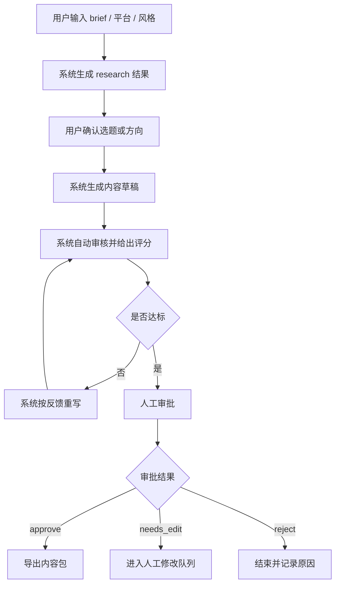
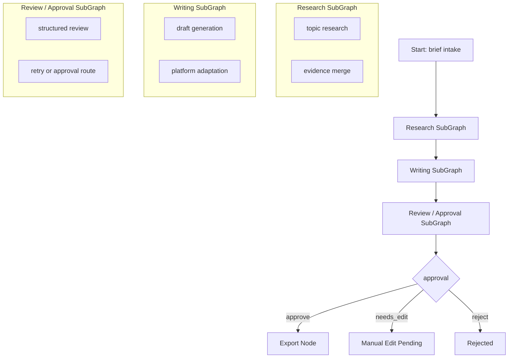

# 项目2阶段0：PRD 与用户流程图

最后更新：2026-04-09

## 1. 产品定义

产品名称：

`Graph RAG 自媒体内容运营系统`

一句话定义：

> 面向个人创作者和小团队运营，用图工作流把 brief 拆成研究、写作、审核、审批、导出等阶段，并提供可恢复、可回查、可测量的内容生产闭环。

## 2. 背景

目标用户在内容运营里最缺的往往不是“写一句文案”的能力，而是：

- 把模糊 brief 变成可执行选题
- 稳定地产出符合平台风格的内容
- 控制质量，而不是完全相信一次生成
- 在多人协作中保留审批、返工和回查能力

传统做法的问题是：

- 选题、写作、改稿、导出分散在多个工具里
- 流程状态不可见
- 内容返工没有结构化记录
- 很难留下可复盘的数据和证据

## 3. 目标用户

### 3.1 核心用户

- 中小企业自媒体运营
- 个人内容创作者
- 自由职业代运营

### 3.2 非核心但兼容的用户

- MCN 运营团队
- 市场内容团队

## 4. 核心问题

本项目要解决的不是“AI 会不会写”，而是 4 个更具体的问题：

1. brief 到内容之间缺少结构化流程
2. 内容质量不稳定，缺少审核与返工闭环
3. 多平台适配费时，且难以标准化
4. 现有 AI 产出难回查、难恢复、难度量

## 5. 产品目标

### 5.1 业务目标

- 让用户从一个 brief 出发，获得一份可审阅、可导出、可多平台适配的内容包
- 降低选题、写稿、改稿的总耗时
- 提升内容生产的一致性与可复用性

### 5.2 工程目标

- 真迁 `LangGraph StateGraph`
- 真迁 `PostgreSQL Checkpointer`
- 引入 `SubGraph`
- 提供流式事件输出
- 提供结构化校验与 fallback
- 提供基础稳定性治理
- 对关键优化保留 before/after 测量结果

## 6. 核心使用场景

### 场景A：个人创作者从 0 到 1 生成平台内容

输入：

- 一个内容 brief
- 目标平台
- 内容风格

输出：

- 研究后的候选角度
- 通过审核的内容草稿
- 导出的 Markdown / JSON 内容包

### 场景B：运营人员需要保留审批与返工

流程：

- AI 生成草稿
- Reviewer 给出评分和建议
- 不通过时自动重写
- 人工最终给出 `approve / needs_edit / reject`

### 场景C：需要回查历史 run

目标：

- 根据 `run_id` 查到历史状态
- 看到流程执行过哪些节点
- 必要时从中断态恢复

## 7. 产品原则

1. 不追求全自动发文，优先保证“可控”。
2. 人工审批是产品能力，不是流程障碍。
3. LLM 负责生成与判断，工程系统负责边界与恢复。
4. 每个可写简历的亮点都要能被测量。

## 8. MVP 范围

### 8.1 业务 MVP

必须具备：

- brief intake
- research
- writer
- reviewer
- approval
- export
- run_id 回查

### 8.2 简历级工程 MVP

在业务 MVP 之上，必须补齐：

- LangGraph StateGraph
- PostgreSQL Checkpointer
- SubGraph
- SSE / 事件流
- Mock 开关体系
- JSON mode + 手动解析 + Pydantic 校验
- `/health`
- 限流
- before/after 基线测量

## 9. 非目标

当前阶段不作为硬目标：

- 自动发布到真实平台
- 完整品牌资产中心
- 复杂多模态素材生产
- 企业级账单系统

## 10. 核心流程设计

### 10.1 用户主流程

### 10.2 系统工作流

## 11. 核心输入输出

### 11.1 输入

- `brief`
- `platform`
- `style`
- 可选的审批决策
- 可选的运行模式：real / mock

### 11.2 输出

- 研究结果
- 草稿内容
- 审核结果
- 审批状态
- 导出内容包
- metrics
- 事件流

## 12. 成功指标

### 12.1 业务指标

- 端到端流程可稳定跑通
- 审核闭环可触发并收敛
- 生成结果可导出并复用

### 12.2 工程指标

- 可按 `run_id` 回查
- 可输出节点级 metrics
- 可观测流式事件
- 关键优化具备 baseline / optimized 对比

## 13. 版本拆分建议

### V0：需求确认版

- 明确产品问题
- 明确竞品与替代方案
- 明确自研理由

### V1：业务闭环版

- 跑通 `brief -> research -> writer -> reviewer -> approval -> export`

### V2：工程化对标版

- 真迁 LangGraph
- 真迁 Postgres
- 加 SubGraph、SSE、稳定性治理、schema 校验与测量机制

## 14. 本阶段优先级

### P0

- 跑通 `brief -> research -> writer -> reviewer -> approval -> export`
- 明确人工审批边界
- 明确 run_id 回查能力

### P1

- 真迁 `LangGraph StateGraph`
- 真迁 `PostgreSQL Checkpointer`
- 引入 `SubGraph`
- 引入 `JSON Mode + 手动解析 + Pydantic 校验`

### P2

- SSE / 事件流
- `/health`
- 限流
- graceful shutdown
- before / after 基线测量

## 15. 本阶段验收标准

- 你能用自己的话说清楚项目2的目标用户、核心问题、MVP 和非目标。
- 你能解释为什么这个项目不是“AI 写作工具”，而是“内容工作流系统”。
- 你能解释为什么后面必须真迁 `LangGraph + PostgreSQL`，而不是继续沿用旧版状态机。
- 用户流程图和系统流程图都能对得上主链路，不存在“图里有、产品里没有”的节点。

## 16. 对旧 PRD 的取舍建议

保留：

- 用户画像
- 审核维度
- 平台内容适配思路

重写：

- 产品入口：从“领域关键词”改为 `brief intake`
- 产品目标：从“做一个 AI 运营工具”改为“做一个可恢复、可观测、可审批的内容工作流系统”
- 技术目标：写清楚当前是复现路线，不把目标态当现状
- 成功标准：加入工程指标与测量文件要求
