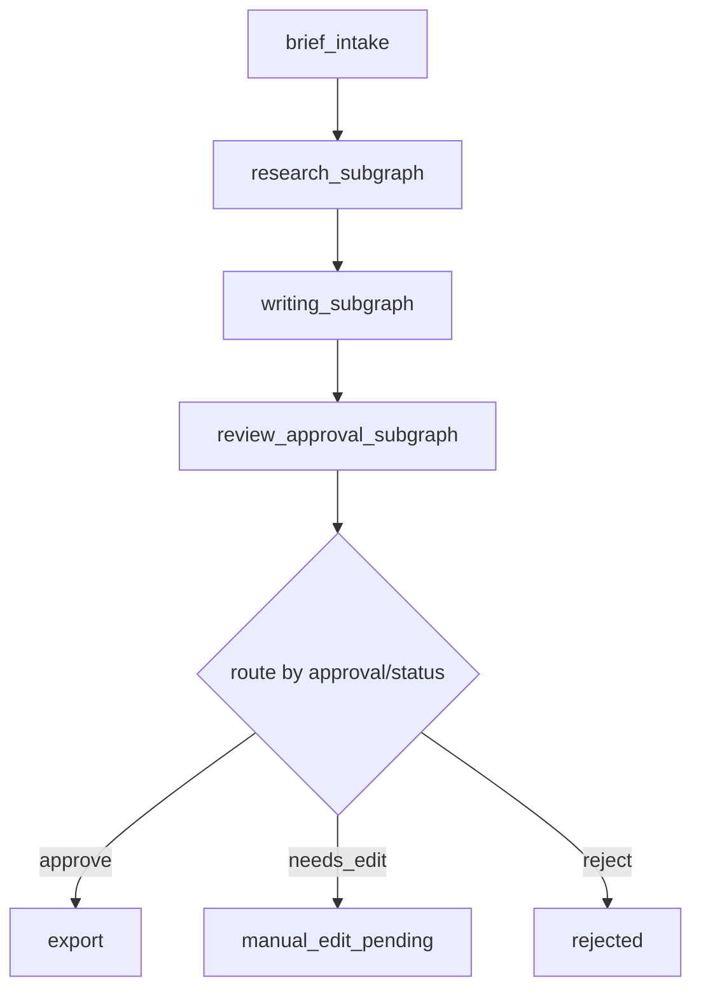

# 项目2阶段2：LangGraph StateGraph 结构设计

最后更新：2026-04-09

## 1. 这一步要解决什么问题

上一阶段我们已经把项目拆成了节点（Node，节点）和状态（State，状态）。

这一阶段要解决的是：

- 这些节点在图里怎么连接
- 哪些是固定顺序
- 哪些地方要做条件分流
- 哪些部分应该拆成子图（SubGraph，子图）
- 为什么这个项目适合用 `StateGraph`（状态图）而不是手写流程

## 2. 先解释几个会反复出现的词

- `StateGraph`（状态图）：一种由“状态 + 节点 + 路由”组成的工作流结构，节点之间的流转由状态驱动。
- `Edge`（边）：节点与节点之间的连接关系。
- `Conditional Edge`（条件边）：根据当前状态决定下一步去哪个节点的连接关系。
- `Entry Point`（入口节点）：图开始执行时先进入的节点。
- `END`（结束节点）：图执行完成的终点。

## 3. 为什么这个项目适合用 StateGraph

这个项目之所以适合 `StateGraph`，不是因为它“听起来高级”，而是因为它天然符合图工作流的几个特征：

1. 这是一个多阶段流程，不是单次问答。
2. 流程里存在条件分支，比如审核通过 / 重写 / 驳回。
3. 流程需要持久化和恢复，不能只靠函数顺序执行。
4. 后面还要接流式事件、测量、审批和回查。

如果继续用手写状态机，也能跑，但会越来越难：

- 节点增多后难维护
- 分支增多后难看清
- 恢复语义难统一
- 事件流和指标很难挂得优雅

## 4. 项目2主图（Main Graph）设计

## 4.1 主图的目标

主图解决的是“全局流程怎么走”。

它不需要塞太多细节，只负责串起几个核心阶段：

1. `brief_intake`
2. `research_subgraph`
3. `writing_subgraph`
4. `review_approval_subgraph`
5. `export`

## 4.2 主图结构

## 4.3 为什么主图不能直接把所有节点都铺平

如果把所有细节点全部堆在主图里，短期看简单，长期会很乱。

比如以后加这些能力时：

- 外部搜索
- 多平台适配
- 并发任务
- 结构化审核
- 流式事件

主图会迅速膨胀。

所以主图应该只保留**阶段级语义**，细节交给子图处理。

## 5. 子图（SubGraph）设计

## 5.1 `Research SubGraph`（研究子图）

职责：

- 把 brief 转成候选 topic
- 补充 evidence（证据、参考信息）
- 输出 research 结果

建议节点：

- `research_topic`
- `research_evidence_merge`

为什么要拆出来：

- 后面如果加 Graph RAG、外部搜索、并发检索，这部分变化最大
- 单独拆出来，主图不会被研究逻辑污染

## 5.2 `Writing SubGraph`（写作子图）

职责：

- 根据选题生成草稿
- 按平台做适配

建议节点：

- `write_draft`
- `adapt_platform`

为什么要拆出来：

- writer 后面最容易引入模型路由、结构化输出、并发生成
- 这部分变化会很多，拆出来更稳

## 5.3 `Review / Approval SubGraph`（审核审批子图）

职责：

- reviewer 给出结构化评分
- 决定是否重写
- 最终进入审批

建议节点：

- `review_structured`
- `review_route`
- `approval_gate`

为什么要拆出来：

- 这是项目2最能体现人机协作和质量控制的地方
- 也是条件路由最复杂的地方

## 6. 条件边（Conditional Edge）设计

## 6.1 最关键的条件边：审核结果路由

这里是整张图的核心。

逻辑不是“review 结束就下一步 export”，而是：

### 情况A：审核通过

- `review.total_score >= reviewer_threshold`
- 进入 `approval_gate`

### 情况B：审核不通过，但还没超过最大重写次数

- `review.total_score < reviewer_threshold`
- `revision_count < max_revisions`
- 回到 `write_draft`

### 情况C：审核不通过，且已经达到最大重写次数

- 不再自动重写
- 进入 `approval_gate`
- 由人工决定 `needs_edit` 或 `reject`

## 6.2 审批后的条件边

### `approve`

- 进入 `export`

### `needs_edit`

- 进入 `manual_edit_pending`

### `reject`

- 进入 `rejected`

## 7. 入口节点（Entry Point）设计

入口节点建议是：

- `brief_intake`

原因：

- 它是用户输入正式进入系统的第一站
- 这里最适合生成 `run_id / request_id / 初始 state`
- 后面无论是 UI、CLI、API、SSE，入口语义都统一

## 8. 为什么不是从 research 直接作为入口

旧版看起来像是从 research 开始，但那是实现层的简化。

从产品和工程角度，真正的入口应该是：

- 先接用户输入
- 再初始化运行上下文
- 再进入 research

这样后面做：

- `Checkpointer`（持久化）
- `request_id`
- 日志追踪
- mock / real mode 切换

才更自然。

## 9. 状态在图中的作用

图并不是“节点一个接一个跑完”这么简单。

`State`（状态）在图里承担三个角色：

### 9.1 传递上下文

前一个节点的输出，变成后一个节点的输入。

### 9.2 决定路由

比如：

- `review.total_score`
- `revision_count`
- `approval.decision`

这些字段会直接决定下一条边往哪走。

### 9.3 支撑恢复

如果中途断了，系统不是重头再来，而是看当前状态恢复执行。

这也是后面 `PostgreSQL Checkpointer` 真正有价值的原因。

## 10. 这一步和 PostgreSQL Checkpointer 的关系

`Checkpointer`（状态持久化器）现在还没正式接入，但这一步其实已经在为它做准备。

因为：

- 没有清楚的图结构，就不知道保存什么
- 没有清楚的状态字段，就不知道恢复什么
- 没有条件边，就不知道恢复后该接着往哪走

所以 `StateGraph` 设计，是接 `PostgreSQL Checkpointer` 之前必须走的一步。

## 11. 设计原则总结

1. 主图只保留阶段级语义，不塞过多细节。
2. 变化大、逻辑复杂的部分拆成子图。
3. 条件边只依赖明确的状态字段，不写模糊逻辑。
4. 审核和审批必须区分，不能混成一个节点。
5. 图的结构必须天然支持持久化、恢复和事件流。

## 12. 本阶段验收标准

- 你能说清楚为什么项目2适合 `StateGraph`。
- 你能说清主图和子图分别负责什么。
- 你能解释 reviewer 路由和 approval 路由的区别。
- 你能解释为什么入口节点应该是 `brief_intake`。

## 13. 下一步会接什么

这一阶段做完，下一步自然接：

- `PostgreSQL Checkpointer` 接入设计
- 为什么要从 SQLite 升级
- 如何让状态恢复、历史回查和 LangGraph 结构对上
