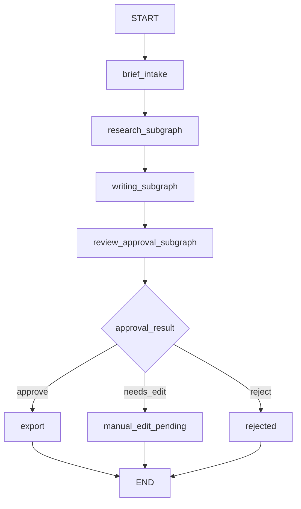

# 项目2阶段2：LangGraph 结构设计

最后更新：2026-04-09

## 1. 这一步要解决什么问题

节点与状态设计已经回答了：

- 系统要拆成哪些业务步骤
- 每一步要带什么上下文

这一步要继续回答：

- 这些节点应该怎么连起来
- 哪些地方是直连，哪些地方要条件分支
- 哪些步骤适合拆成 `SubGraph`（子图）
- `Checkpointer`（状态持久化器）放在整个结构里的什么位置

## 2. 先解释几个关键词

- `LangGraph`：用于构建大模型工作流的图式编排框架。
- `StateGraph`（状态图）：用统一状态对象驱动节点执行和流转的图结构。
- `Edge`（边）：两个节点之间的连接关系。
- `Conditional Edge`（条件边）：根据状态判断决定流向哪条边。
- `SubGraph`（子图）：主图中的某一段子流程，单独拆出来组织和复用。
- `START / END`：图的开始和结束。

## 3. 为什么这个项目适合用 `StateGraph`

这个项目本质上不是“单轮生成”，而是一条多阶段业务链路：

- brief intake
- research
- writer
- reviewer
- approval
- export

而且它天然带有：

- 条件分支
- 重写回路
- 人工审批节点
- 历史状态回查
- 流式事件需求

这几类能力都说明它更适合用 `StateGraph`，而不是几个函数线性串起来。

## 4. 主图设计

## 4.1 主图的职责

主图只做一件事：

> 负责调度整条内容工作流，而不是把所有业务细节都塞进去。

所以主图应该尽量薄，只保留：

- 流程入口
- 子图调度
- 审批结果路由
- 导出与结束

## 4.2 主图节点建议

主图建议保留 5 个核心节点：

1. `brief_intake`
2. `research_subgraph`
3. `writing_subgraph`
4. `review_approval_subgraph`
5. `export`

对应关系：

- `brief_intake`：建立运行上下文
- `research_subgraph`：完成选题与证据组织
- `writing_subgraph`：完成草稿与平台化内容生成
- `review_approval_subgraph`：完成质量判断、重写路由、审批
- `export`：输出最终内容包

## 4.3 主图示意

## 5. 为什么要拆 `SubGraph`

不拆子图也能跑，但会很快遇到两个问题：

1. 主图变得很胖，后面不容易维护。
2. 某一段流程想增强时，会把整张图搞乱。

所以更合理的方式是：

- 主图负责调度
- 子图负责业务段落

## 6. `Research SubGraph`（研究子图）

## 6.1 目标

把模糊 brief 转成更适合写作的结构化研究结果。

## 6.2 推荐节点

- `research_topic`
- `research_evidence_merge`

## 6.3 这样拆的原因

- `research_topic` 更偏“生成候选方向”
- `research_evidence_merge` 更偏“汇总证据、清洗输出”

这样拆以后，后面如果要接：

- 外部搜索
- Graph RAG
- 并发素材检索

都可以继续往这个子图里加，而不会污染主图。

## 7. `Writing SubGraph`（写作子图）

## 7.1 目标

把研究结果转换成可审核的内容草稿，并按平台做必要适配。

## 7.2 推荐节点

- `write_draft`
- `adapt_platform`

## 7.3 这样拆的原因

- `write_draft` 是生成内容主体
- `adapt_platform` 是把内容变成更接近平台原生风格的交付物

后面如果要补：

- 多模型路由
- 多平台并发适配
- 封面/素材扩展

都可以以这个子图为基础往外扩。

## 8. `Review / Approval SubGraph`（审核审批子图）

## 8.1 目标

这部分既要完成质量判断，也要保留人工业务决策。

## 8.2 推荐节点

- `review_structured`
- `review_route`
- `approval_gate`

## 8.3 这样拆的原因

- `review_structured`：输出结构化审核结果
- `review_route`：决定是否回写重写
- `approval_gate`：承接人工审批

这样做最大的好处是：

- reviewer 不直接变成“最终裁决者”
- 审核与审批语义清楚
- rewrite 回路有明确入口

## 9. `Conditional Edge`（条件边）设计

## 9.1 review 之后的条件边

review 之后至少有两类判断：

### 判断一：是否达标

- 达标：进入 `approval_gate`
- 未达标且未超最大重写次数：回到 `write_draft`

### 判断二：是否超过重写上限

- 超过上限：也进入 `approval_gate`
- 由人工决定 `needs_edit` 或 `reject`

## 9.2 approval 之后的条件边

approval 之后有三种结果：

- `approve` -> `export`
- `needs_edit` -> `manual_edit_pending`
- `reject` -> `rejected`

## 10. `Checkpointer`（状态持久化器）放在哪里

`Checkpointer` 不属于某个业务节点，它属于整张图的运行时能力。

它的作用是：

- 保存每次运行中的状态
- 支持按 `thread_id / run_id` 恢复
- 为历史回查提供基础

所以它应当挂在：

- 主图 compile 时的运行层

而不是：

- 某一个节点里自己手动存数据库

这也是为什么后面必须从 SQLite 版迁走。

## 11. 流式输出挂点

这一步先不写 SSE 代码，但结构上要先考虑事件从哪来。

建议事件粒度包括：

- node started
- node finished
- state updated
- review routed
- approval decided
- export generated

这样后面接：

- `astream_events`（异步事件流）
- `SSE`（服务端事件推送）

就有天然挂点。

## 12. 为什么这个结构比旧版更好

旧版的问题不是“完全错误”，而是：

- 业务逻辑和调度逻辑耦合太紧
- checkpoint 是自己维护的 SQLite 存储
- 后续要加子图、事件流、恢复能力时扩展性不够

而这个新结构的优势是：

- 主图与子图职责清楚
- 状态统一
- 条件边显式
- 后续接 Postgres、SSE、限流、健康检查都更自然

## 13. 本阶段验收标准

- 你能说清楚主图负责什么，子图负责什么。
- 你能解释为什么 review 后需要 `Conditional Edge`。
- 你能解释为什么 `Checkpointer` 应该属于运行层而不是某个节点。
- 你能说清楚为什么这个项目适合 `StateGraph`，不适合继续用简单函数串联。

## 14. 下一步衔接

这一步之后，下一步最自然就是：

- `PostgreSQL Checkpointer` 接入设计
- `State` 字段和 `Schema`（结构约束）进一步收紧
- `JSON Mode + 手动解析 + Pydantic` 节点协议设计
